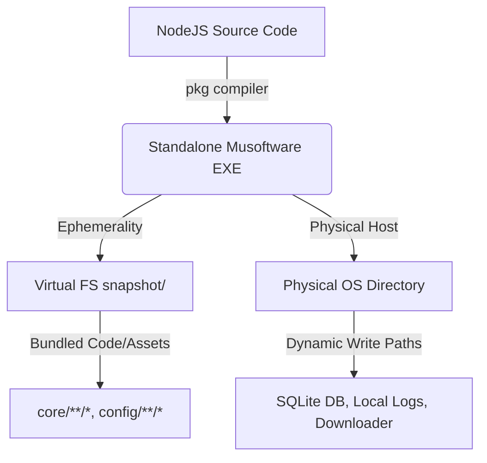
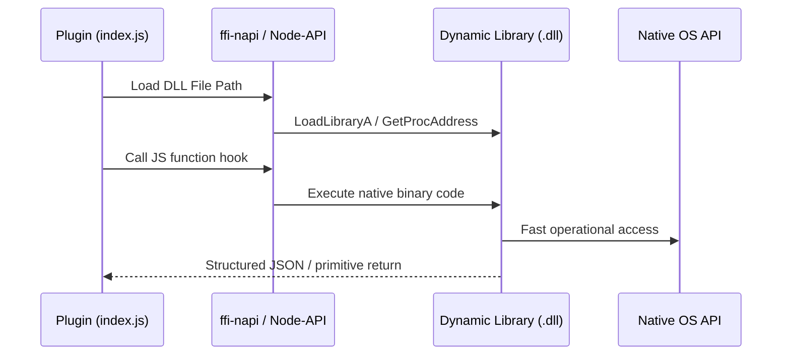

# Musoftware Compilation, Packaging & Distribution

This skill governs the compilation of the **Musoftware Unified Runtime** into a single-file executable, the generation of modern Windows installers, the strict enforcement of versioning boundaries, and the integration/packaging of native `DLL` plugins.

---

## Activation Conditions
This skill automatically applies when you are:
- Configuring or executing build commands (`pkg`, `nexe`, etc.) for the NodeJS runtime.
- Modifying packaging configurations in `package.json` (`pkg` properties, script builds).
- Creating or editing installer configuration scripts (e.g., **Inno Setup** `.iss` files).
- Modifying path resolution logic (`__dirname`, `process.execPath`) to support packaged execution.
- Implementing dynamic binary loading or compiling native modules (C/C++/Rust DLLs) within a plugin.
- Updating system update checks, SemVer version matching, or binary signature verifications.

---

## 1. Packaged Runtime Execution (`.exe`)

The Musoftware Runtime is packaged into a standalone, single-file executable using `pkg`. This eliminates the need for the user to install NodeJS, git, or other dependencies manually.



### Build Pipeline Configuration
In `package.json`, compile properties must explicitly map which files are bundled inside the executable, and which targets are built:

```json
"pkg": {
  "assets": [
    "core/**/*",
    "config/**/*"
  ],
  "targets": [
    "node22-win-x64",
    "node22-macos-x64",
    "node22-linux-x64"
  ]
}
```

### Critical Path Resolution Rule
Inside a packaged executable, path handling changes dramatically. You must strictly adhere to the following directory rules:
- **`__dirname`**: Points inside the virtual filesystem (`/snapshot/musoftware-runtime/...`). Use **only** for reading immutable files bundled at compile-time (e.g., core libraries, bundled template configs).
- **`process.execPath`**: Points to the absolute path of the compiled physical `.exe` on the host machine.
- **Physical Root Directory**: Resolve using `path.dirname(process.execPath)`. All dynamic writes (SQLite database, log directories, dynamically downloaded plugins) **MUST** resolve relative to this path.

#### Standard Path Resolver Implementation
```javascript
const path = require('path');

const isPackaged = process.pkg !== undefined;

// Root where the user running the software has read/write privileges
const RUNTIME_ROOT = isPackaged 
    ? path.dirname(process.execPath) 
    : path.resolve(__dirname, '..');

// DB and dynamic folders
const STORAGE_DIR = path.join(RUNTIME_ROOT, 'storage');
const LOGS_DIR    = path.join(RUNTIME_ROOT, 'logs');
const PLUGINS_DIR = path.join(RUNTIME_ROOT, 'plugins');
```

### Handling Native Node Addons (`.node`)
Native C++ add-ons (like `better-sqlite3`) cannot be executed directly from inside the virtual `/snapshot` filesystem.
1. `pkg` compiles the JS but leaves the binary `.node` file external.
2. In production, ensure the pre-compiled `.node` binary for the target architecture is packaged directly next to the `.exe` in the installer, or extracted dynamically on boot.
3. Configure `require()` statements to gracefully fallback or load the native module from the physical folder.

---

## 2. Inno Setup Windows Installer

To deliver a premium, install-and-run experience, use **Inno Setup** to build the installer executable. The installer handles setup, service configuration, and uninstall cleanup.

```ini
; MusoftwareRuntime.iss - Inno Setup Template
[Setup]
AppId={{D3B073C3-F9E4-4D3B-A87A-E26F3E6D012B}
AppName=Musoftware Runtime
AppVersion=1.0.0
DefaultDirName={localappdata}\Programs\MusoftwareRuntime
DefaultGroupName=Musoftware
UninstallDisplayIcon={app}\musoftware-runtime-win.exe
Compression=lzma2
SolidCompression=yes
OutputDir=dist
OutputBaseFilename=musoftware-runtime-installer

[Files]
Source: "dist\musoftware-runtime-win.exe"; DestDir: "{app}"; Flags: ignoreversion
Source: "node_modules\better-sqlite3\build\Release\better_sqlite3.node"; DestDir: "{app}\node_modules\better-sqlite3\build\Release"; Flags: ignoreversion
; Include default templates
Source: "config\*"; DestDir: "{app}\config"; Flags: ignoreversion recursesubdirs createallsubdirs

[Icons]
Name: "{group}\Musoftware Runtime"; Filename: "{app}\musoftware-runtime-win.exe"
Name: "{userstartup}\Musoftware Runtime"; Filename: "{app}\musoftware-runtime-win.exe"; Parameters: "--background"

[Registry]
; Configure run on Windows Startup
Root: HKCU; Subkey: "Software\Microsoft\Windows\CurrentVersion\Run"; ValueType: string; ValueName: "MusoftwareRuntime"; ValueData: """{app}\musoftware-runtime-win.exe"" --background"; Flags: uninsdeletevalue
```

### Core Installer UX Rules
1. **Silent Service Boot**: On install completion, fire the executable with `--background` to initialize the system tray without spawning browser windows unexpectedly.
2. **Clean Uninstallation**: Inno Setup only deletes files it installed. Dynamic runtime files (e.g. `storage/runtime.db`, `logs/*.log`, and sync'd plugins) **must** be cleaned up programmatically using the `[Code]` section:

```pascal
[Code]
procedure CurUninstallStepChanged(JustAfterAnsi: TUninstallStep);
begin
  if JustAfterAnsi = usPostUninstall then
  begin
    // Clean up dynamic local directories
    DelTree(ExpandConstant('{app}\storage'), True, True, True);
    DelTree(ExpandConstant('{app}\logs'), True, True, True);
    DelTree(ExpandConstant('{app}\plugins'), True, True, True);
  end;
end;
```

3. **Installer Distribution Constraint**: The distributed executable in the platform's public download folder (e.g., `musoftware-runtime-win.exe` at `/downloads/runtime/windows/`) **MUST ALWAYS** be the compiled Inno Setup installer bundle, never the raw standalone runtime executable. The build/publish script must compile the raw EXE, and then invoke Inno Setup Compiler (`ISCC.exe`) to package the raw EXE, Node bindings, and default configuration templates into the final distributed setup executable.

---

## 3. Strict SemVer Versioning & Updates

Musoftware applies strict Semantic Versioning (`MAJOR.MINOR.PATCH`) to preserve stability across the distributed ecosystem.

```
       [ Cloud Platform ] v1.4.2
               │
               ▼ (Compatibility Check)
       [ Local Runtime ]  v1.2.0  ◄──[ Plugin Manifest ] v1.0.0 (Requires: ^1.2.0)
```

### Versioning Rules
- **MAJOR**: Incompatible API shifts, breaking changes to the generic WebSocket RPC layer, or major database schema restructures.
- **MINOR**: Backward-compatible functionality, adding new generic RPC endpoints, or upgrading underlying runtime node/python engines.
- **PATCH**: Backward-compatible bug fixes and stability tweaks.

### Update Pipeline Flow
1. **Check**: The Runtime Agent queries `https://musoftwares.com/api/runtime/latest` hourly.
2. **Determine**: If a newer version is available and meets the local user's update group, the runtime downloads the signed installer in the background.
3. **Execute**: The runtime initiates a silent installer run:
   ```bash
   musoftware-installer.exe /SILENT /VERYSILENT /SUPPRESSMSGBOXES /NORESTART
   ```
4. **Transition**: The running instance catches the termination signal, gracefully shuts down active plugin routines, and yields to the installer process.

---

## 4. Packaging Native DLLs for Plugins

For advanced operations (e.g., rapid screen capture, native OS control, custom Chromium extensions, protected intellectual property), plugins can package dynamic libraries (`.dll` on Windows, `.dylib` on macOS, `.so` on Linux).



### Guidelines for DLL Packaging & Loading
- **Relative Path Resolution**: Native libraries must reside in a dedicated folder (e.g., `bin/`) within the plugin zip package. Load them using relative calculations:
  ```javascript
  const path = require('path');
  const os = require('os');
  
  // Resolve correct binary based on host architecture
  const arch = os.arch(); // 'x64' | 'arm64'
  const dllPath = path.join(__dirname, 'bin', `scrapper_${arch}.dll`);
  ```
- **Loading Interface**: Use lightweight bindings such as **`ffi-napi`** or build pre-compiled Node-API (N-API) wrappers (`.node` extensions) to call exported functions directly.
  ```javascript
  const ffi = require('ffi-napi');
  
  const nativeLib = ffi.Library(dllPath, {
      'InitializeSession': [ 'int', [ 'string', 'int' ] ],
      'TriggerAction':     [ 'string', [ 'int', 'string' ] ],
      'CloseSession':      [ 'void', [ 'int' ] ]
  });
  ```

### Native Binary Security Constraints
> [!CAUTION]
> Native binaries run out-of-process or inside the main process memory space without NodeJS sandbox restrictions.
> - **Signature Checks**: The runtime `SecurityManager` must verify the hash of any DLL file against the plugin signature in `manifest.json` before loading.
> - **Error Resilience**: Call native functions within safe wrappers. A crash in native compiled code (e.g. Segmentation Fault) will kill the entire runtime orchestrator process.

---

## Summary Checklist

- [ ] Does dynamic directory generation (SQLite, logs, plugins) target `path.dirname(process.execPath)` instead of `__dirname`?
- [ ] Is `better-sqlite3` configured to gracefully reference the external physical `.node` file?
- [ ] Does the installer cleanly register registry keys under `HKCU` for startup launch without administrative privilege prompts?
- [ ] Does the uninstaller clean up dynamic databases, logs, and downloaded plugins on full purge?
- [ ] Are dynamic DLL files loaded relative to the plugin folder (`__dirname`) and matched strictly to host architecture?
- [ ] Are dynamic libraries called inside try-catch bounds or safe Node-API wrappers to prevent crashing the runtime?
- [ ] Is the deployed Windows asset in the platform's downloads folder the full Inno Setup installer package instead of the raw standalone EXE?
