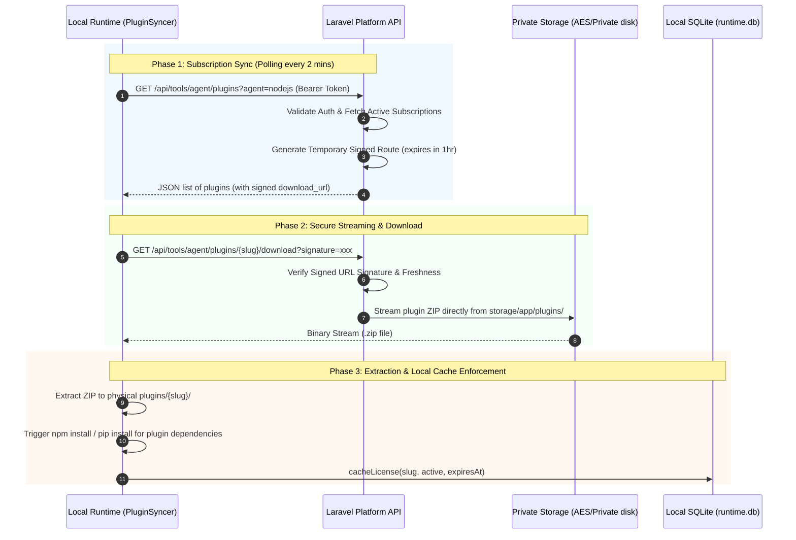

# Musoftware Plugin Distribution & Licensing

This skill governs the secure platform-to-runtime distribution, temporary link signing, private storage streaming, local zip extraction, dynamic dependency compilation, and local SQLite license caching for Musoftware plugins.

---

## Activation Conditions
This skill automatically applies when you are:
- Modifying backend plugin distribution or marketplace API routes in Laravel.
- Editing the local plugin synchronization engine (`PluginSyncer`) or downloading components (`PluginLoader`).
- Working with private file storage and secure download links (signed URLs).
- Configuring automatic plugin updates, version comparisons, or dynamic environment package installations (`npm install`, `pip install`).
- Designing database schemas or local tables for tracking active user tool licenses.

---

## 1. End-to-End Distribution Architecture

To secure proprietary plugins and prevent unlicensed redistribution, the system utilizes a **License-Gated Streaming Flow** connecting the Cloud Platform to the Local Runtime.



---

## 2. Laravel Backend Route & Controller Implementation

### Route Configuration (`Modules/Tools/routes/api.php`)
Both sync and download routes must be grouped under appropriate middleware to enforce authenticated device requests.

```php
Route::middleware(['auth:sanctum'])->prefix('tools')->name('api.tools.')->group(function () {
    // 1. Subscription & Free Plugins Polling Endpoint
    Route::get('/agent/plugins', function (\Illuminate\Http\Request $request) {
        $agentType = $request->query('agent', 'nodejs'); // 'nodejs' | 'python'

        // Fetch active user subscriptions
        $subscriptions = \Modules\Tools\Models\ToolSubscription::where('user_id', auth()->id())
            ->where('status', 'active')
            ->where(fn($q) => $q->whereNull('expires_at')->orWhere('expires_at', '>', now()))
            ->with(['tool.latestVersion'])
            ->get();

        $paidPlugins = $subscriptions
            ->filter(fn($s) => $s->tool && $s->tool->latestVersion)
            ->filter(fn($s) => ($s->tool->metadata['runtime'] ?? 'nodejs') === $agentType)
            ->map(fn($s) => [
                'tool_slug'      => $s->tool->slug,
                'name'           => $s->tool->title,
                'version'        => $s->tool->latestVersion->version,
                'download_url'   => $s->tool->latestVersion->file_path
                    ? url()->temporarySignedRoute('api.tools.plugin.download', now()->addHour(), ['slug' => $s->tool->slug])
                    : null,
                'is_subscribed'  => true,
                'license_status' => $s->status,
                'expires_at'     => $s->expires_at?->toIso8601String(),
            ]);

        $subscribedSlugs = $paidPlugins->pluck('tool_slug')->all();

        // Fetch active free plugins (bypasses subscription checks)
        $freePlugins = \Modules\Tools\Models\Tool::where('is_active', true)
            ->whereNotIn('slug', $subscribedSlugs)
            ->with('latestVersion')
            ->get()
            ->filter(fn($t) => ($t->metadata['runtime'] ?? 'nodejs') === $agentType && $t->latestVersion !== null)
            ->map(fn($t) => [
                'tool_slug'      => $t->slug,
                'name'           => $t->title,
                'version'        => $t->latestVersion->version,
                'download_url'   => $t->latestVersion->file_path
                    ? url()->temporarySignedRoute('api.tools.plugin.download', now()->addHour(), ['slug' => $t->slug])
                    : null,
                'is_subscribed'  => false,
                'license_status' => 'active',
                'expires_at'     => null,
            ]);

        return response()->json(['plugins' => $paidPlugins->merge($freePlugins)->values()]);
    })->name('agent.plugins');

    // 2. Private Signed Download Route
    Route::get('/agent/plugins/{slug}/download', function (\Illuminate\Http\Request $request, string $slug) {
        if (!$request->hasValidSignature()) {
            abort(403, 'Invalid or expired download link.');
        }
        
        $tool    = \Modules\Tools\Models\Tool::where('slug', $slug)->firstOrFail();
        $version = $tool->latestVersion;
        
        if (!$version || !$version->file_path || !\Illuminate\Support\Facades\Storage::exists($version->file_path)) {
            abort(404, 'Plugin file not found.');
        }
        
        return \Illuminate\Support\Facades\Storage::download($version->file_path);
    })->name('plugin.download');
});
```

> [!IMPORTANT]
> **No Public Zip Files.** Zip packages of proprietary plugins must **NEVER** be placed inside the `public/` directory. They must always reside in private storage (`storage/app/plugins/...`) and stream to authorized clients through a signature-checked controller response.

---

## 3. Local Runtime Synchronization Engine (`plugin-syncer.js`)

The `PluginSyncer` polls the platform API at defined intervals. It coordinates between local directory verification, downloaded ZIP files, database caching, and hot reloading.

### Local SQLite License Caching
Rather than calling the cloud platform before every task run, the runtime writes subscription metadata to local SQLite (`runtime.db`). This serves as a sub-millisecond license gate.

```javascript
// Writing subscription status to local SQLite
this.storage.upsertLicense(plugin.tool_slug, {
    status:    plugin.license_status ?? 'active',
    expiresAt: plugin.expires_at ?? null,
});
```

### Revoking Unsubscribed Tools
If a synced tool is no longer returned in the active subscriptions list, the local orchestrator revokes the local license status, preventing execution:

```javascript
const installedPlugins = this.pluginLoader.getAll();
for (const installed of installedPlugins) {
    const slug = installed.tool_slug;
    if (!slug) continue;
    
    // Revoke license if the subscription is no longer active
    if (!subscribedSlugs.has(slug)) {
        const prevStatus = this.storage.checkLicense(slug);
        if (prevStatus === 'active') {
            this.logger.warn(`[syncer] License revoked for: ${slug}`);
            this.storage.revokeLicense(slug);
            this.broadcast('plugin.license_revoked', { slug });
        }
    }
}
```

---

## 4. Downloader and Local Installer (`plugin-loader.js`)

When a new plugin is detected, `PluginLoader.ensurePlugin(slug, downloadUrl)` is executed. It downloads the file, decompresses it into a isolated workspace directory, and installs runtime system dependencies.

```javascript
async ensurePlugin(toolSlug, downloadUrl, broadcast) {
    const pluginDir = path.join(this.pluginsDir, toolSlug);
    const zipPath   = path.join(this.pluginsDir, `${toolSlug}.zip`);

    try {
        // 1. Download ZIP to local temporary file
        await this._downloadFile(downloadUrl, zipPath);
        fs.mkdirSync(pluginDir, { recursive: true });

        // 2. Extract ZIP archive
        const zip = new AdmZip(zipPath);
        zip.extractAllTo(pluginDir, true);
        fs.unlinkSync(zipPath); // clean up downloaded zip

        // 3. Read and validate manifest
        const result = this._readAndValidateManifest(pluginDir);
        if (!result) throw new Error('manifest.json missing or invalid after install');

        const runtime = result.runtime || 'nodejs';

        // 4. Clean dynamic dependency compilation
        if (runtime === 'nodejs') {
            const pkgJson = path.join(pluginDir, 'package.json');
            if (fs.existsSync(pkgJson)) {
                this.logger.info(`[loader] running npm install for ${toolSlug}...`);
                execSync('npm install --production --silent', { cwd: pluginDir, timeout: 120_000 });
            }
        } else if (runtime === 'python') {
            const reqTxt = path.join(pluginDir, 'requirements.txt');
            if (fs.existsSync(reqTxt)) {
                const pythonBin = this.config.pythonBin || 'python';
                this.logger.info(`[loader] running pip install for ${toolSlug}...`);
                execSync(
                    `${pythonBin} -m pip install -r requirements.txt --quiet`,
                    { cwd: pluginDir, timeout: 180_000 }
                );
            }
        }

        // 5. Register & load into module cache
        this._plugins.set(result.id, { ...result, dir: pluginDir });
        this._loadModule(result);

        this.logger.info(`[loader] Plugin successfully installed: ${toolSlug} v${result.version}`);
        broadcast?.('plugin.installed', { toolSlug, version: result.version });
        return this._plugins.get(result.id);

    } catch (err) {
        this.logger.error(`[loader] Install failed for ${toolSlug}: ${err.message}`);
        if (fs.existsSync(zipPath))   fs.unlinkSync(zipPath);
        if (fs.existsSync(pluginDir)) fs.rmSync(pluginDir, { recursive: true, force: true });
        throw err;
    }
}
```

> [!CAUTION]
> **Dependency Isolation.** Do not allow plugins to run package installations globally or overwrite central core dependencies. All package installs must target the scoped plugin folder using `{ cwd: pluginDir }` to ensure zero cross-plugin side effects.

---

## 5. Proprietary Secure Plugin Format (.msp)

To protect proprietary software from unlicensed redistribution and reverse-engineering, plugins are packaged into the proprietary **Musoftware Secure Plugin (`.msp`)** binary format.

### Binary Envelope Structure

The `.msp` file is compiled linearly into a single binary envelope:

| Offset (Bytes) | Size (Bytes) | Data Field | Description |
|---|---|---|---|
| `0` | `4` | **Magic Signature** | Literally the ASCII characters `MUSP` (`0x4D555350`) |
| `4` | `4` | **Metadata Length** | `uint32be` length of the scrambled metadata section |
| `8` | `N` | **Scrambled Metadata** | Custom TLV Protobuf-like layout, scrambled via XOR |
| `8 + N` | `M` | **Scrambled Payloads** | Linear concatenation of scrambled file payloads |

### Cryptographic Scrambling

All metadata records and file payloads within the package are scrambled using a symmetric **XOR Cipher** seeded by a cryptographic key:

1. **Secure Salt**: `'MusoftwarePluginSecretSalt2026!'`
2. **Cipher Key**: SHA-256 hash of the secure salt (`32-byte` digest).
3. **Scramble Loop**: For each byte at index `i`, `output[i] = input[i] ^ key[i % 32]`.

### Custom Type-Length-Value (TLV) Metadata Layout

The decrypted metadata is parsed sequentially. File records are defined by a proprietary Protobuf-like layout bounded by start/end tags:

- **Start-of-Record Tag**: `0x0A`
- **Field 1 (Path String Tag & Prefix)**: `0x12` followed by a single byte length-prefix, then the UTF-8 relative path string (e.g. `index.js`). Max length 255 bytes.
- **Field 2 (Size Tag & Payload)**: `0x18` followed by `uint32be` scrambled size of the payload.
- **Field 3 (Offset Tag & Payload)**: `0x20` followed by `uint32be` starting offset of the scrambled payload in the payloads section.
- **End-of-Record Tag**: `0x0B`

### Double-Layer AST Obfuscation

Before packaging `.js` files into `.msp`, the JavaScript code undergoes dynamic high-strength obfuscation:

1. **AST Scrambling**:
   - `controlFlowFlattening: true` (threshold: 0.75) for dynamic path execution scrambling.
   - `stringArrayEncoding: ['base64']` (threshold: 0.75) for literal string obfuscation.
   - `splitStrings: true` (chunk length: 10) to break identifiers into chunks.
   - `selfDefending: false` (to prevent execution wrapper assertion failures under Node CJS).
2. **Synchronous Hex-Eval Wrap**: The scrambled output is compiled into hex, then wrapped within a second-layer envelope:
   `eval(Buffer.from("<HEX_OBFUSCATED_CODE>", "hex").toString("utf8"));`

---

## 6. Secure In-Memory Plugin Execution

To prevent users from extracting compiled code and to ensure zero-disk traceability, plugins are kept encrypted on disk as `.msp` archives. During runtime execution, the files are handled 100% in-memory using a virtual filesystem interceptor and global require hooking.

### In-Memory Virtual Filesystem Interceptor
The runtime intercepts Node's global `fs` and `fs.promises` APIs for paths under the virtual plugin directory (e.g. `plugins/{slug}/`). Any calls to `readFileSync`, `existsSync`, `statSync`, `readdirSync`, or their promise equivalents are intercepted to serve content dynamically from the decrypted memory buffers.
To ensure Node's internal module resolution doesn't throw `ENOENT` on virtual directories, we patch realpath APIs (`fs.realpathSync`, `fs.realpath`, and `fs.promises.realpath`) to return the virtual path directly without checking the physical disk.

### Bundled Dependency Interception
Because in-memory plugins execute outside the snapshot context of the compiled binary, standard module resolution for external node modules (e.g. `better-sqlite3`, `ws`, `puppeteer`) will fail on a clean end-user machine. 
To resolve this, the runtime hooks Node's `Module._load` globally to intercept require calls for bundled dependencies and reroute them to the runtime's own snapshot-aware require function:

```javascript
const Module = require('module');
const originalLoad = Module._load;
const parentRequire = require; // Runtime's own require (snapshot-aware)
const BUNDLED_DEPS = new Set([
    'adm-zip', 'axios', 'better-sqlite3', 'cors', 'dotenv', 'express',
    'helmet', 'ioredis', 'multer', 'node-fetch', 'nodemailer', 'openai',
    'playwright', 'playwright-extra', 'puppeteer', 'puppeteer-extra-plugin-stealth',
    'qrcode-terminal', 'semver', 'sqlite3', 'uuid', 'winston', 'ws'
]);

Module._load = function(request, parent, isMain) {
    if (BUNDLED_DEPS.has(request)) {
        return parentRequire(request);
    }
    return originalLoad.apply(this, arguments);
};
```

---

## Summary Checklist

- [ ] Are plugin ZIP files stored in a private directory inside the Laravel platform (`storage/app/plugins/`)?
- [ ] Are all direct links to plugin archives blocked, using `url()->temporarySignedRoute()` exclusively for downloads?
- [ ] Do download signatures expire within a short interval (e.g. 1 hour) to prevent URL sharing?
- [ ] Does the local runtime write validated subscription properties to the local SQLite database to prevent boot delays?
- [ ] Does the `PluginSyncer` revoke local license cache entries as soon as a tool subscription is deactivated in the cloud?
- [ ] Are npm/pip installations executed with a timeout and strictly scoped to the plugin directory via `{ cwd }`?
- [ ] If download or installation crashes, are temporary files (`.zip`/`.tmp`) and partial directories deleted immediately?
- [ ] Are proprietary plugins compiled into `.msp` binary envelope files with the `MUSP` signature instead of legacy `.zip` archives?
- [ ] Are `.js` files obfuscated using AST flattening + hex-eval wrappers before packaging?
- [ ] Is the cryptographic XOR scrambling key derived dynamically from the SHA-256 digest of the `'MusoftwarePluginSecretSalt2026!'` salt?
- [ ] Are decrypted plugin source files loaded 100% in-memory with zero physical decrypted files ever written to disk?
- [ ] Are calls to bundled node modules (e.g. `better-sqlite3`, `ws`) intercepted and routed directly through the runtime's compiled snapshot?
