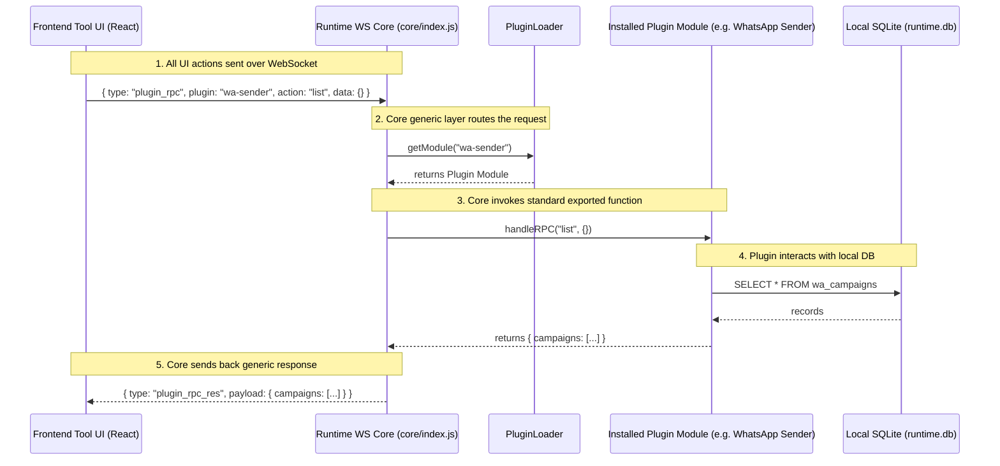

# Musoftware Plugin SDK

This skill defines how plugins are structured, versioned, and executed within the Musoftware Local Runtime. Plugins are headless workers controlled entirely by the Cloud UI, and they must adhere strictly to the **Apple-Level Simplicity** philosophy.

## Activation Conditions
This skill automatically applies when you are:
- Creating a new plugin for the Musoftware Marketplace.
- Modifying an existing plugin's code or `manifest.json`.
- Debugging plugin compatibility with the Local Runtime.

## 1. Plugin Creation Standards
Every plugin MUST contain:
- `manifest.json`: Defines metadata, requirements, and versions.
- Worker entrypoint code (NodeJS/Python).
- Frontend UI components (injected into the Web Control Plane).

## 2. Progressive Disclosure & Smart Defaults
While the backend worker is extremely advanced, the Plugin UI exposed to the user must be simple.
- **Smart Defaults**: The plugin should intelligently choose defaults for delays, retries, and concurrency. The user should rarely configure these.
- **Progressive Disclosure**: Simple UI does not mean removing functionality. Powerful parameters should be grouped under terms like "Fast", "Balanced", or "Safe" in the UI, while the SDK/Worker maps those to complex internal configs.
- **Advanced Settings**: Powerful parameters should remain accessible but hidden behind expandable sections.

## 3. Communication Standards & Invisible Infrastructure
The Plugin SDK handles IPC and WebSocket communication with the NodeJS Orchestrator.
- The runtime handles the complexity. The plugin simply emits standard events (`progress`, `log`, `success`, `error`) and reacts to commands (`start`, `stop`).
- The user should never see terms like "Trigger Worker" or "IPC Timeout". The UI must use human terms like "Start Campaign" and "Automatic Recovery".

## 4. Development Constraints
> [!WARNING]
> **Hide the Engine.** Never expose low-level config schemas, retry engine specs, or browser fingerprint configs directly in the primary UI workflow.

> [!IMPORTANT]
> **Graceful Shutdowns.** Plugins must cleanly shut down upon receiving a stop command to ensure the system feels seamless and bulletproof.

## Summary Checklist
- [ ] Is the plugin exposing smart defaults rather than demanding technical configuration?
- [ ] Are advanced configurations hidden via progressive disclosure?
- [ ] Are the UI interactions labeled with human, non-technical language?


# Tool UI Architecture System

## Core Philosophy
Each major tool/plugin must feel like a **real standalone software product**, not a one-page dashboard, simple form, or shallow CRUD layout.
Think of tools like independent workspaces (e.g., Notion, Slack, Linear, VSCode) operating inside the Musoftware ecosystem. The user should feel: "I entered a real application."

## Tool Layout Architecture
Large tools MUST have dedicated application layouts.
Structure:
<ToolShell>
  <ToolSidebar />
  <ToolHeader />
  <WorkspaceTabs />
  <MainWorkspace />
  <RealtimePanel />
</ToolShell>

NEVER build a plugin as a single giant page or a giant form. 

## Workspace Routing & Navigation
Plugins must support internal workspace routing (e.g., `/tools/whatsapp/accounts`, `/tools/whatsapp/campaigns`).
Do not flatten workflows into one screen. Every major entity must have a dedicated workspace tab.

## Software-Grade UX
Tools must support persistent state, operational workflows, realtime feedback, workspace continuity, and internal routing. They are installable-grade operational applications, NOT admin templates or settings dumps.

## Operational Entities
Entities (e.g., Accounts, Campaigns, Monitoring Jobs) must have dedicated pages, operational states, history, activity feeds, and realtime updates. 

## Realtime Software Feeling
Tools must feel alive. Always support live updates, realtime logs, websocket events, queue progress, and live activity feeds.

## Advanced UI Simplicity
Even advanced systems must feel simple and guided through progressive disclosure, contextual actions, clean navigation, and focused workspaces. Hide runtime complexity and engine internals completely.

## Final AI Behavior
When generating plugins or tools, automatically build full multi-workspace layouts, separate operational domains, and create a complete software-grade UX without needing user reminders.


# Runtime-First Architecture & Execution

## Critical Engineering Philosophy
The Frontend UI is ONLY an **operational control surface**. The REAL system exists exclusively inside the **Runtime Agent + Workers**.
- Buttons MUST trigger real runtime commands.
- Uploads MUST stream directly to the runtime.
- Tasks execute locally via the runtime.
- Logs, statuses, and progress MUST stream from the runtime via WebSockets.
- The Runtime is the absolute source of truth.

## No More Fake UI
NEVER create fake dashboards, static metrics, fake progress bars, mock runtime states, disconnected tabs, dead buttons, or simulated success messages. 
Tables, cards, and widgets MUST display real runtime data, not hardcoded placeholders.

## Architecture Responsibility
**Frontend (UI)**: ONLY renders state, triggers actions via Runtime SDK, subscribes to events, and displays progress. It NEVER owns operational logic or truth.
**Runtime Agent**: Handles execution, queues, workers, automation, browser sessions, local storage, CSV parsing, retries, logs, and concurrency. IT OWNS the operational entities (Campaigns, Queues, Sessions).
**Laravel Backend Strict Rule**: 
For any Tool/Plugin, its ONLY connection to the Laravel backend is checking if the user is subscribed to the service or not.
EVERYTHING ELSE related to the tools (data, configurations, campaigns, logs, operational entities, processing) MUST be handled by the Local Runtime Agent and stored locally in the client's local SQLite database. The Laravel backend must NEVER be used to store or process tool-specific data.

## Realtime System Requirement
Operational software MUST feel alive. You must always implement:
- Live logs
- Live queue states
- Live runtime heartbeat
- Realtime progress updates
- WebSocket event subscriptions

## Final AI Behavior
When building tools, you must constantly ask: 
- "Where does this operation actually execute?"
- "Is this runtime-owned or frontend-owned?"
- "How does realtime synchronization work?"
Never stop at a beautiful UI. Build fully operational, runtime-connected infrastructure.


**Communication Architecture Strict Rule**:
1. **WebSocket ONLY**: ALL communication between the UI and the Tool Plugin MUST happen EXCLUSIVELY via WebSockets. No HTTP REST endpoints.
2. **Generic Fixed Layer**: You MUST build a generic layer with fixed functions in the Local Runtime. This generic layer must NEVER change per tool. 
3. **Plugin Communication**: The Tool Plugin must communicate with the UI strictly via this generic WebSocket layer. The frontend sends a generic payload (e.g., `{ plugin: 'whatsapp-sender', action: 'get_campaigns' }`) over the WebSocket, and the runtime routes this internally to the installed plugin.


## Generic WebSocket RPC Layer Architecture

All tools and plugins MUST be built using the exact following architecture. The UI communicates strictly over WebSockets, the Runtime routes it generically, and the Plugin handles it.



### Standardized Plugin API (`handleRPC`)
Every plugin in the `plugins/` directory MUST export an async `handleRPC(action, data)` function from its entry file to handle synchronous data queries (like reading from SQLite) coming from the UI via the Generic WS Layer.

Example of what the plugin must look like internally:
```javascript
// plugins/whatsapp-sender/index.js
module.exports.handleRPC = async (action, data) => {
    if (action === 'list_campaigns') {
        return { campaigns: [...] }; // fetch from sqlite
    }
    throw new Error('Unknown action: ' + action);
};
```

