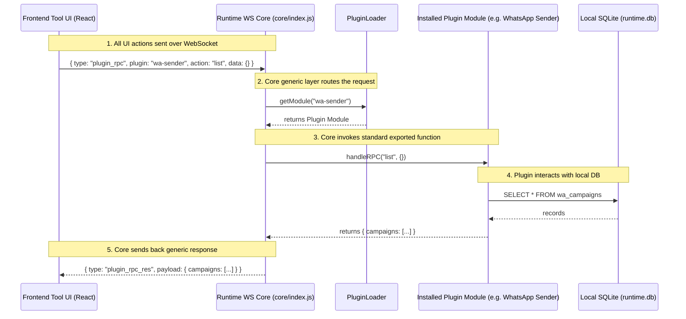

# Musoftware Architecture

This skill defines the overarching architecture of the Musoftware ecosystem, dictating how the various components—frontend, backend, runtime agent, plugins, and workers—interact. The goal is to provide a complete understanding of system topology without needing repeated explanations.

## Activation Conditions
This skill automatically applies when you are:
- Designing new modules, plugins, or services.
- Tracing data flow from the web application to the local runtime.
- Debugging execution boundary issues (e.g., UI vs Runtime).
- Making architectural changes or reviewing system boundaries.

## 1. System Topology Overview

The Musoftware ecosystem is strictly divided into two primary execution planes:
1. **The Web Control Plane (Cloud)**
2. **The Local Execution Plane (Runtime)**

These planes communicate via robust Websocket architectures, WebRTC (where applicable), and secure API tunnels.

### The Web Control Plane
- **Tech Stack**: Laravel (Backend), React + Shadcn (Frontend).
- **Responsibility**: Orchestrates the business logic (ERP/CRM), user interface, authentication, billing, and plugin marketplace.
- **Rule**: NO heavy lifting or local operations happen here. It is strictly the control interface.

### The Local Execution Plane (The Runtime)
- **Tech Stack**: NodeJS (Orchestrator) + Python (Workers/Executors) + other languages in the future.
- **Responsibility**: Executes plugins, manages local hardware resources, runs automation tasks, and performs the actual "work".
- **Rule**: NO UI lives in the local runtime. It is a headless daemon that receives commands from the Web Control Plane.

## 2. Plugin Philosophy (CRITICAL)

Plugins in the Musoftware ecosystem have a very specific definition:
- Plugins are **NOT** isolated apps, Electron apps, independent dashboards, or standalone websites.
- Plugins **ARE** runtime workers controlled entirely by the website UI.

### The Flow
1. **Website UI**
2. **Runtime Agent**
3. **Plugin Worker**
4. **Local Execution**

The execution happens **locally** on the runtime, but the UI lives **inside the website**.

## 3. Runtime Architecture Memory

There is **ONE unified runtime agent**. We do not use separate Python agents and NodeJS agents running independently.
- The runtime orchestrates workers, manages plugins, handles websocket communication, controls updates, manages lifecycle, and exposes local APIs.
- **NodeJS** acts as the orchestration layer.
- **Python** (and other languages) acts as the worker runtime.

## 4. Module Boundaries & Communication

### Website UI vs Local Runtime
- **Strict Separation**: The UI strictly lives on the Website (Web Control Plane). The Local Runtime has zero UI.
- **Communication Protocol**:
    - The Website sends "Commands" or "Jobs" via WebSockets/API to the Local Runtime.
    - The Local Runtime executes the task and emits real-time telemetry, logs, and progress events back to the Website.

### Local Runtime Architecture
- **NodeJS Orchestrator**: Handles WebSocket connections, plugin management, marketplace downloads, and lifecycle management.
- **Workers**: Launched by NodeJS to handle heavy tasks (data processing, scraping, AI inference). They operate in isolated execution contexts.
- **Plugin Orchestration**: Plugins are dynamically loaded packages. The Runtime downloads them, provisions them, and routes commands to them.

## 5. Tool Registration (`config/tools.php`)
When adding a new tool to the Musoftware ecosystem, you MUST register it directly in `config/tools.php`.
- Do not rely on database seeders or `register_tool.php` scripts as the source of truth.
- Open `config/tools.php`, generate a new UUID for the tool, and define its metadata, slug, features, plans, and `runner_component` (React UI).
- The Marketplace UI and backend routing generate their listings dynamically based strictly on this config file.

## 6. Security Memory

The runtime interacts closely with the user's local system. Strict security measures are enforced:
- **Localhost-only Runtime**: The runtime only binds to localhost and cannot be accessed externally.
- **Signed Requests**: All communication between the Cloud Control Plane and the Local Runtime is authenticated and signed.
- **WebSocket Auth**: WebSockets enforce token validation.
- **Plugin Isolation**: Plugins run in isolated environments to prevent cross-contamination or unauthorized system access.
- **Runtime Verification**: The local runtime verifies plugins downloaded from the marketplace before execution.

> [!CAUTION]
> **Never expose the runtime publicly.** Never bypass runtime authentication or create insecure local APIs.

## 6. Architectural Rules & Constraints

> [!WARNING]
> **Never mix execution boundaries.** Do not design UI components that depend on running inside the local runtime, and do not design Laravel controllers that attempt to do local hardware tasks directly.

> [!IMPORTANT]
> **Event-Driven Mindset.** All cross-plane communication is asynchronous and event-driven. Design with the assumption that the local runtime might disconnect, reconnect, or take a long time to process.

## Summary Checklist
- [ ] Is the logic placed in the correct execution plane (Cloud vs Local)?
- [ ] Is communication between UI and Runtime utilizing the correct WebSocket events?
- [ ] Are plugins correctly structured as runtime workers rather than standalone UI apps?
- [ ] Are security boundaries respected (no public runtime exposure)?


# Runtime-First Architecture & Execution

## Critical Engineering Philosophy
The Frontend UI is ONLY an **operational control surface**. The REAL system exists exclusively inside the **Runtime Agent + Workers**.
- Buttons MUST trigger real runtime commands.
- Uploads MUST stream directly to the runtime.
- Tasks execute locally via the runtime.
- Logs, statuses, and progress MUST stream from the runtime via WebSockets.
- The Runtime is the absolute source of truth.

## No More Fake UI
NEVER create fake dashboards, static metrics, fake progress bars, mock runtime states, disconnected tabs, dead buttons, or simulated success messages. 
Tables, cards, and widgets MUST display real runtime data, not hardcoded placeholders.

## Architecture Responsibility
**Frontend (UI)**: ONLY renders state, triggers actions via Runtime SDK, subscribes to events, and displays progress. It NEVER owns operational logic or truth.
**Runtime Agent**: Handles execution, queues, workers, automation, browser sessions, local storage, CSV parsing, retries, logs, and concurrency. IT OWNS the operational entities (Campaigns, Queues, Sessions).
**Laravel Backend Strict Rule**: 
For any Tool/Plugin, its ONLY connection to the Laravel backend is checking if the user is subscribed to the service or not.
EVERYTHING ELSE related to the tools (data, configurations, campaigns, logs, operational entities, processing) MUST be handled by the Local Runtime Agent and stored locally in the client's local SQLite database. The Laravel backend must NEVER be used to store or process tool-specific data.

## Realtime System Requirement
Operational software MUST feel alive. You must always implement:
- Live logs
- Live queue states
- Live runtime heartbeat
- Realtime progress updates
- WebSocket event subscriptions

## Final AI Behavior
When building tools, you must constantly ask: 
- "Where does this operation actually execute?"
- "Is this runtime-owned or frontend-owned?"
- "How does realtime synchronization work?"
Never stop at a beautiful UI. Build fully operational, runtime-connected infrastructure.


**Communication Architecture Strict Rule**:
1. **WebSocket ONLY**: ALL communication between the UI and the Tool Plugin MUST happen EXCLUSIVELY via WebSockets. No HTTP REST endpoints.
2. **Generic Fixed Layer**: You MUST build a generic layer with fixed functions in the Local Runtime. This generic layer must NEVER change per tool. 
3. **Plugin Communication**: The Tool Plugin must communicate with the UI strictly via this generic WebSocket layer. The frontend sends a generic payload (e.g., `{ plugin: 'whatsapp-sender', action: 'get_campaigns' }`) over the WebSocket, and the runtime routes this internally to the installed plugin.


## Generic WebSocket RPC Layer Architecture

All tools and plugins MUST be built using the exact following architecture. The UI communicates strictly over WebSockets, the Runtime routes it generically, and the Plugin handles it.



### Standardized Plugin API (`handleRPC`)
Every plugin in the `plugins/` directory MUST export an async `handleRPC(action, data)` function from its entry file to handle synchronous data queries (like reading from SQLite) coming from the UI via the Generic WS Layer.

Example of what the plugin must look like internally:
```javascript
// plugins/whatsapp-sender/index.js
module.exports.handleRPC = async (action, data) => {
    if (action === 'list_campaigns') {
        return { campaigns: [...] }; // fetch from sqlite
    }
    throw new Error('Unknown action: ' + action);
};
```

