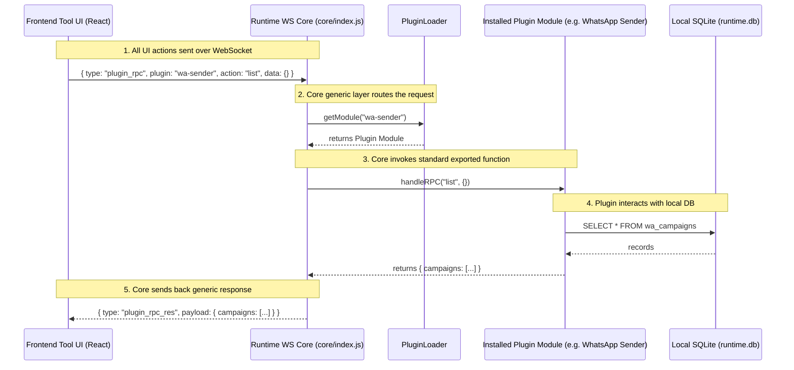

# Websocket System

This skill details the real-time communication infrastructure that makes Musoftware feel "alive". It covers telemetry, job commands, presence, and plugin communication.

## Activation Conditions
This skill automatically applies when you are:
- Emitting real-time events from the Laravel backend.
- Handling incoming telemetry in the React frontend.
- Managing the connection between the NodeJS Orchestrator and the Cloud.
- Defining new WebSocket event namespaces for Plugins.

## 1. System Topology & Strict Communication Flow
The Frontend NEVER talks directly to workers.
**Frontend -> Runtime API/WebSocket -> Runtime Agent (Orchestrator) -> Worker Process**

- **The Hub**: Laravel Reverb, Soketi, or Pusher.
- **The Clients**:
  - The Web Browser (React frontend receiving updates).
  - The Local Runtime Agent (NodeJS daemon receiving commands and sending telemetry).

## 2. Event Naming Conventions
Always use a clear namespace:
- `plugin.progress` - The local runtime reporting job progress for a specific worker.
- `job.command` - The cloud commanding the runtime orchestrator to start/stop a worker.
- `entity.updated` - The backend notifying the frontend that a CRM/ERP record changed.

## 3. Realtime Operational UI
- When a WebSocket event is received (e.g., `plugin.progress` = 50%), the UI should react instantly without requiring a page refresh or an extra HTTP `GET` request.
- Use global state managers or React Query's optimistic updates to reflect execution states dynamically.

## 4. Resilience & State
WebSockets are inherently fragile.
- **Do Not Rely Exclusively on WS**: If a WebSocket drops, the system must not lose data. The Local Runtime caches logs/progress and bulk-uploads them via HTTP if WS fails.
- **Reconnection Logic**: The Frontend and the Local Runtime must have robust exponential backoff reconnection strategies.

## Summary Checklist
- [ ] Are WebSocket events properly namespaced?
- [ ] Is communication strictly routed through the Runtime Orchestrator (Frontend never talks directly to workers)?
- [ ] Does the UI update reactively without polling?


# Runtime-First Architecture & Execution

## Critical Engineering Philosophy
The Frontend UI is ONLY an **operational control surface**. The REAL system exists exclusively inside the **Runtime Agent + Workers**.
- Buttons MUST trigger real runtime commands.
- Uploads MUST stream directly to the runtime.
- Tasks execute locally via the runtime.
- Logs, statuses, and progress MUST stream from the runtime via WebSockets.
- The Runtime is the absolute source of truth.

## No More Fake UI
NEVER create fake dashboards, static metrics, fake progress bars, mock runtime states, disconnected tabs, dead buttons, or simulated success messages. 
Tables, cards, and widgets MUST display real runtime data, not hardcoded placeholders.

## Architecture Responsibility
**Frontend (UI)**: ONLY renders state, triggers actions via Runtime SDK, subscribes to events, and displays progress. It NEVER owns operational logic or truth.
**Runtime Agent**: Handles execution, queues, workers, automation, browser sessions, local storage, CSV parsing, retries, logs, and concurrency. IT OWNS the operational entities (Campaigns, Queues, Sessions).
**Laravel Backend Strict Rule**: 
For any Tool/Plugin, its ONLY connection to the Laravel backend is checking if the user is subscribed to the service or not.
EVERYTHING ELSE related to the tools (data, configurations, campaigns, logs, operational entities, processing) MUST be handled by the Local Runtime Agent and stored locally in the client's local SQLite database. The Laravel backend must NEVER be used to store or process tool-specific data.

## Realtime System Requirement
Operational software MUST feel alive. You must always implement:
- Live logs
- Live queue states
- Live runtime heartbeat
- Realtime progress updates
- WebSocket event subscriptions

## Final AI Behavior
When building tools, you must constantly ask: 
- "Where does this operation actually execute?"
- "Is this runtime-owned or frontend-owned?"
- "How does realtime synchronization work?"
Never stop at a beautiful UI. Build fully operational, runtime-connected infrastructure.


**Communication Architecture Strict Rule**:
1. **WebSocket ONLY**: ALL communication between the UI and the Tool Plugin MUST happen EXCLUSIVELY via WebSockets. No HTTP REST endpoints.
2. **Generic Fixed Layer**: You MUST build a generic layer with fixed functions in the Local Runtime. This generic layer must NEVER change per tool. 
3. **Plugin Communication**: The Tool Plugin must communicate with the UI strictly via this generic WebSocket layer. The frontend sends a generic payload (e.g., `{ plugin: 'whatsapp-sender', action: 'get_campaigns' }`) over the WebSocket, and the runtime routes this internally to the installed plugin.


## Generic WebSocket RPC Layer Architecture

All tools and plugins MUST be built using the exact following architecture. The UI communicates strictly over WebSockets, the Runtime routes it generically, and the Plugin handles it.



### Standardized Plugin API (`handleRPC`)
Every plugin in the `plugins/` directory MUST export an async `handleRPC(action, data)` function from its entry file to handle synchronous data queries (like reading from SQLite) coming from the UI via the Generic WS Layer.

Example of what the plugin must look like internally:
```javascript
// plugins/whatsapp-sender/index.js
module.exports.handleRPC = async (action, data) => {
    if (action === 'list_campaigns') {
        return { campaigns: [...] }; // fetch from sqlite
    }
    throw new Error('Unknown action: ' + action);
};
```

