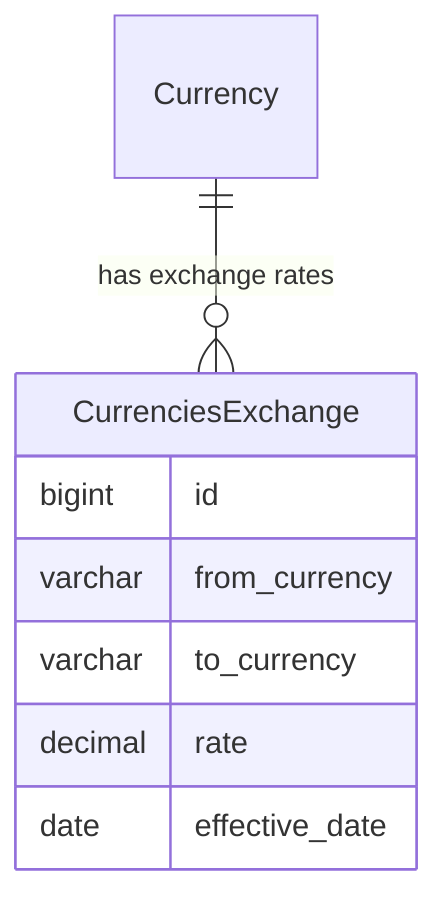
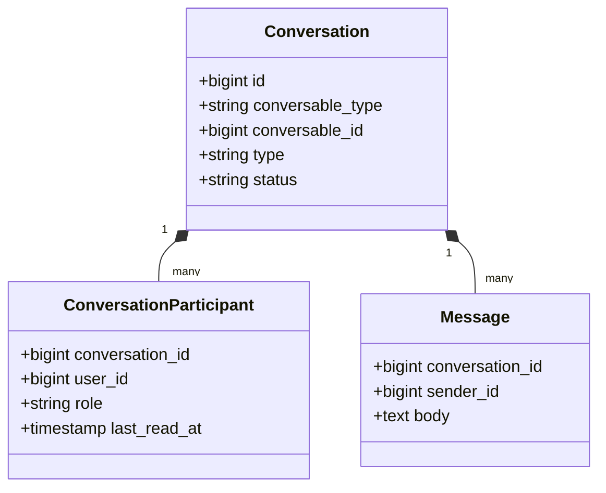

# Musoftwares Ecosystem Core

The **Ecosystem Core** serves as the foundational layer of the Musoftwares platform, a modular Laravel 12 + React 18 SaaS application. It provides the essential shared services, domain models, and utilities that all other business modules (ERP, CRM, Marketplace, Freelance) depend on.

## Overview

Unlike isolated domain modules, the Core layer orchestrates cross-cutting concerns:
- **Financial Baseline**: Currency management and double-entry accounting ledgers.
- **Global Wallets**: Immutable stored-value accounts used across Marketplace and Freelance modules.
- **Real-Time Communication**: A polymorphic conversation engine serving support tickets, marketplace orders, and freelance contracts.
- **System Integrity**: Audit logs, impersonation logs, and global site settings.

## Core Architectural Components

### 1. Currency & Exchange Rate Management
The system enforces strict multi-currency compliance across all transactions.

- **Currencies**: Fiat currencies available in the platform are defined in the `Currency` model. 
- **Exchange Rates**: The system maintains date-locked exchange rate snapshots (`CurrenciesExchange` / `exchange_rates` table). This prevents historical financial mutation when rates fluctuate.

### 2. Double-Entry Accounting Ledgers
To maintain enterprise-grade financial integrity, the Core module implements double-entry accounting.
- **Ledgers & Accounts**: Logical grouping of assets, liabilities, equity, revenue, and expenses.
- **Journal Entries**: Immutable records (`journal_entries` and `journal_entry_lines`) capturing the debit and credit balancing of any financial event in the system.

### 3. Global Wallets System
Users and system entities hold stored-value balances through the polymorphic `wallets` table.
- **Wallet Structure**: Polymorphic relationship `owner_type` and `owner_id`.
- **Transactions**: Every balance modification creates an immutable append-only record in `wallet_transactions` detailing `balance_before`, `balance_after`, and the `reference_type`.

### 4. Polymorphic Chat & Messaging
A unified communication engine powers the entire platform.
- **Conversations**: The `Conversation` model uses `conversable_type` and `conversable_id` to attach a chat room to any entity (e.g., Support Tickets, Marketplace Orders).
- **Participants**: `ConversationParticipant` tracks who is in the room and their `last_read_at` timestamp.
- **Messages & Attachments**: `Message` records contain the body, and `message_attachments` link to files via polymorphic relationships.

## Data Flow & Service Integration

When an external module interacts with the Core, it relies on Service Container Dependency Injection rather than direct raw SQL manipulation. This ensures domain events are fired and ledgers remain balanced.

For instance, when a Marketplace order is completed, the Marketplace module triggers a core Wallet service to securely transfer funds, recording the transaction immutably in `wallet_transactions` and reflecting the movement in the `journal_entries`.

## Security & Auditing

The Core handles critical security logging:
- **Audit Logs**: Every mutation to critical resources is logged via `audit_logs` tracking the `old_values` and `new_values`.
- **Impersonation Logs**: Super-admins can impersonate clients to debug issues. The `impersonation_logs` table records the `impersonator_id`, `impersonated_id`, and exact timestamps to ensure strict accountability.

## References
- Currency Model: [Currency.php](file:///app/Models/Currency.php)
- Wallet Transaction Model: [WalletTransaction.php](file:///app/Models/WalletTransaction.php)
- Conversation Model: [Conversation.php](file:///app/Models/Conversation.php)
- Message Model: [Message.php](file:///app/Models/Message.php)
