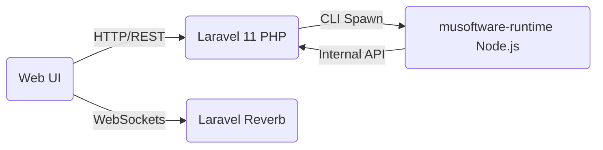

# Runtime Node.js Integration

MuSoftware runs a hybrid architecture: Laravel (PHP) handles the core ERP, and Node.js (`musoftware-runtime`) handles high-performance, real-time tooling, code execution, and persistent agents.

## Architecture Map

## Security & Licensing
- The `musoftware-runtime` is heavily protected against piracy.
- Before executing platform tools, the Node.js script invokes `storage.checkLicense(slug)`.
- This contacts the core licensing server. If a subscription is invalid, the script aborts.

## Real-Time Engine (Reverb)
- WebSockets run locally via Laravel Reverb (`REVERB_PORT=8080`).
- Node.js agents and background queues broadcast events (e.g., `TimerUpdated`, `MessageSent`) to the Laravel event bus, which pumps them directly to the frontend via Reverb.

## Extensibility (Plugins)
- The Node.js runtime natively supports plugin injections.
- Pluggable skills (like `android-cli`) can be invoked securely using standard agent execution flows, running completely local on the user's host machine.
