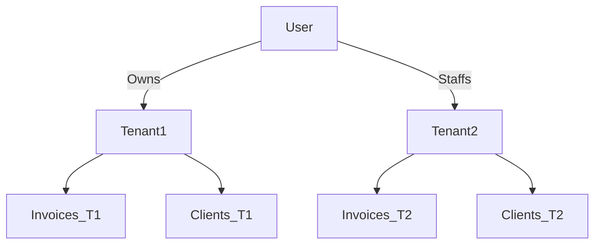

# Tenancy Security Model

MuSoftware ERP allows multiple agencies/businesses to use the platform simultaneously without data leaks.

## Isolation Mechanism
The system relies on single-database, row-level tenancy isolation.
Every tenant-scoped table features a `tenant_id` foreign key.

## The TenantModel Guard
All models in the `Modules\ERP\Models\` namespace extend `TenantModel`.

### `TenantModel` Boot Lifecycle
1. **Global Scope:** On boot, if a user is logged in and a `tenant_id` session exists, `static::addGlobalScope('tenant')` automatically appends `WHERE tenant_id = X` to all SELECT/UPDATE/DELETE queries.
2. **Auto-Assignment:** When a model is instantiated or `created()`, if `tenant_id` is blank, it automatically assigns the session's active `tenant_id`.

### Bypassing Tenancy
Only Background Jobs (CRONs) and Admin Tools bypass the global scope using `Model::withoutGlobalScopes()`. They must explicitly filter by `tenant_id` when looping over records (e.g., the `ProcessRecurringEntries` scheduler).

## File Isolation
Tenant files (documents, project attachments) are isolated physically within their storage disk:
`storage/app/tenants/{tenant_id}/`
